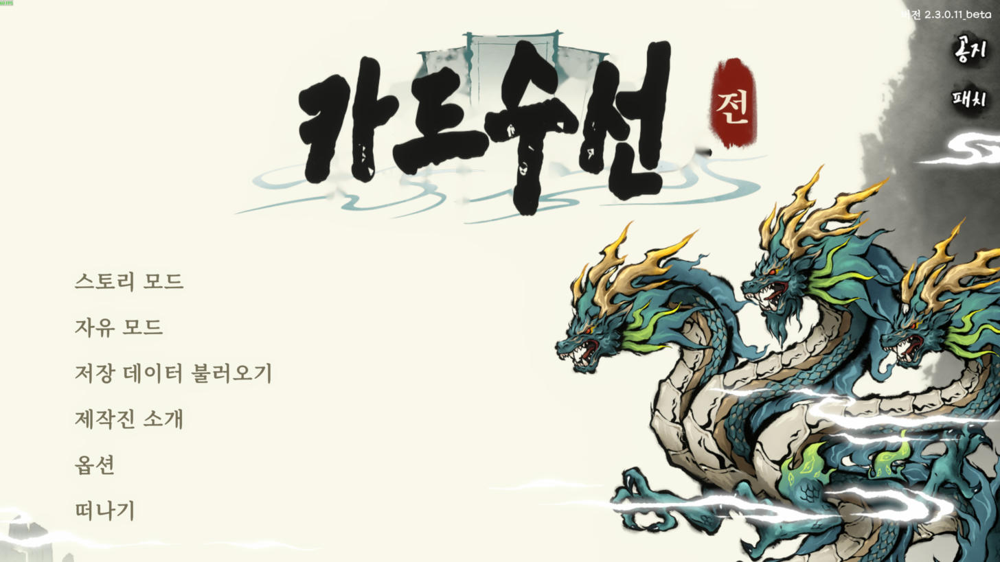
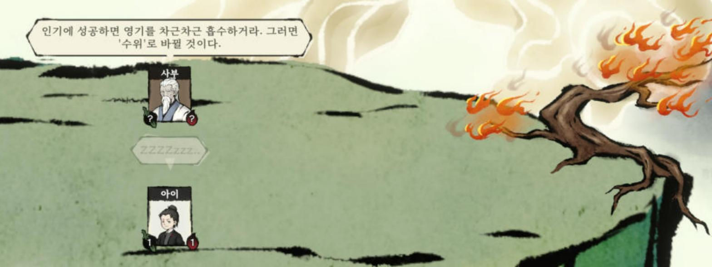

# Card Cultivation 한글화

Steam 게임 **Card Cultivation (修仙卡牌, App 2963600)** 비공식 한국어 패치 작업 저장소.

## 다운로드

### [⬇ 한글 패치 v1.0.1 다운로드](https://github.com/keyrose/Card-Cultivation-Korean/releases/download/v1.0.1/CardCultivation_KoreanPatch_v1.0.1.zip)

([릴리스 페이지](https://github.com/keyrose/Card-Cultivation-Korean/releases/latest) · 게임 버전 2.3.0.11_beta 기준)

1. 게임을 종료하고, zip 을 풀어 `CardCultivation_KoreanPatch.exe` 실행 → **1번(설치)**
2. 게임 실행 → **설정(Options) → Language → `한국어`**
3. 제거는 같은 exe 에서 **2번(원본으로 복구)**, 스팀 업데이트 후 한글이 풀리면 다시 1번

(영어 언어 자리를 한국어로 교체하는 방식이라, 패치 후에는 영어 대신 한국어가 나온다.)




## 진행 현황
- 텍스트 14,517개 항목 전부 번역 (중국어 원문 기준, 영어 참고)
- 이미지 속 글자 약 1,600개 한글화 (`tools/image_specs*.py`): 타이틀 로고, 메뉴/버튼, 본문 아이콘(품질·오행),
  카드 배지(경지·품질), 이펙트 글자, 튜토리얼 카드/설명 이미지, 무공서 표지, 아이템·스킬·무기 아이콘
  - 언어별 이미지는 간체 중국어 원본으로 만든 한국어 이미지를 4개 언어 번들 모두에 넣는다
  - 미처리: 읽을 수 없는 장식 문양(부적 문양, 종 표면 무늬 등)

## 구조
```
tools/
  common.py      경로 설정, .dat 복호화(4바이트 XOR, UnityFS 헤더로 키 유도)
  luban.py       Luban 바이너리 테이블 reader/writer
  extract.py     LubanTables.dat → source/textmapper.json (원문 추출)
  chunks.py      번역 작업 청크 생성 (1단계: 용어, 2단계: 본문)
  merge.py       translation/raw/*.json 검증(태그/자리표시자) → translation/ko.json
  build_font.py  게임 폴백 폰트(FZLiBian)에 Noto Serif KR 한글 글리프 병합
  build.py       번역·폰트를 적용한 게임 파일을 build/ 에 생성
  imgedit.py     이미지 속 글자 지우기(마스크+인페인트) 및 한국어 다시 그리기
  image_specs*.py 이미지별 한글화 사양 (preview_images.py 로 전/후 비교)
  fonts/         Noto Serif/Sans KR, East Sea Dokdo, Song Myung (SIL OFL)
  installer.py   배포용 설치 프로그램 (exe 로 묶임)
  release.py     릴리스 zip 생성
  install.py     build/ 를 게임 폴더에 설치 (원본은 backup/), `restore` 로 복구
source/textmapper.json   원문 (key, zh, zht, en, ru)
translation/STYLE.md     번역 지침·핵심 용어집
translation/raw/         번역 결과 (대표 키 → 한국어)
translation/ko.json      최종 번역 (키 → 한국어, merge.py 가 생성)
```

## 작동 원리
- 모든 게임 텍스트는 `StreamingAssets/LubanTables.dat` 안의 `lang_tbtextmapper` 테이블에
  (키, 간체, 번체, 영어, 러시아어) 형태로 들어 있다. 영어 열을 한국어로 바꾸고,
  `lang_tblanguages` 의 표시명을 `한국어` 로 바꾼다.
- 기본 TMP 폰트 아틀라스에는 한글이 없지만, 누락 글자는 동적 폴백 폰트
  `FangZhengLiBian_GBK_0_SDF_Fallback` 이 원본 TTF에서 런타임 생성한다.
  그래서 그 TTF(`resources.assets`, `Entities/Timer.dat` 안의 Font)에 한글 글리프를 병합한다.

## 사용자용 설치 (릴리스)
GitHub Releases 의 `CardCultivation_KoreanPatch_vX.Y.Z.zip` 을 받아 exe 실행 → 1번(설치).
게임 폴더를 자동으로 찾고, 원본은 게임 폴더 `KoreanPatch_backup/` 에 보관한다. 2번으로 복구.
게임 원본 파일은 배포하지 않고, 사용자 PC의 파일에 번역·글꼴·이미지를 직접 적용한다.

릴리스 만들기: `cd tools && python release.py 1.0.0` → `dist/CardCultivation_KoreanPatch_v1.0.1.zip`
(PyInstaller 필요: `pip install pyinstaller`)

## 빌드 & 설치 (개발용)
필요: Python 3, `pip install UnityPy fonttools opencv-contrib-python-headless`.
게임은 종료한 상태에서:
```bash
cd tools
python merge.py      # 번역 검증·병합
python build.py      # build/ 에 패치 파일 생성
python install.py    # 게임 폴더에 설치 (최초 1회 원본 백업)
python install.py restore   # 원본 복구
```
게임 업데이트 후에는 `backup/` 을 지우고 `extract.py` → `merge.py` → `build.py` → `install.py` 를 다시 실행한다.
